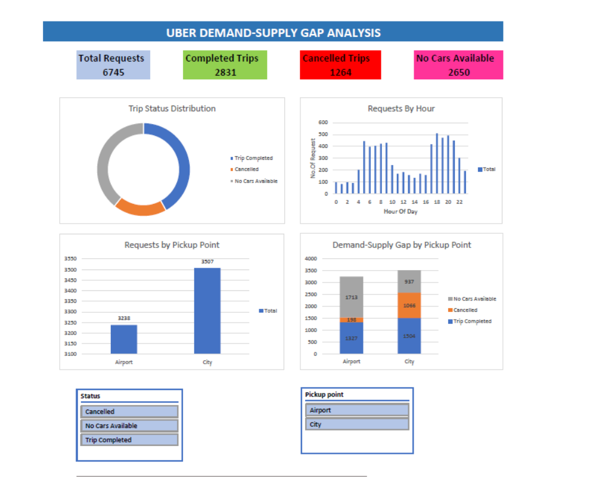

🚖 Uber Demand-Supply Gap Analysis

📌 Project Overview

This project analyzes Uber ride request data using SQL and Excel to identify demand-supply gaps, peak demand hours, cancellation trends, and pickup point patterns. The project combines SQL-based data analysis with an interactive Excel dashboard to generate business insights.

---

🛠️ Tools Used

- MySQL
- Microsoft Excel
- Pivot Tables & Charts
- Slicers
- GitHub

---

Dataset
Uber Request Raw Data containing 6745 requests.

---

Dashboard KPIs
- Total Requests
- Completed Trips
- Cancelled Trips
- No Cars Available

---
Business Questions Solved
- Which hour has maximum demand?
- Which pickup point has maximum requests?
- What is the cancellation rate?
- Where does demand exceed supply?
- Which drivers complete the most trips?

---
Skills Demonstrated

- SQL
- GROUP BY
- Aggregate Functions
- Date & Time Functions
- Business Analysis
- Data Cleaning
- Excel Pivot Tables
- Dashboard Design
- Data Visualization

---

## 🔄 Project Workflow

---
Dashboard Preview

  

---
📊 Key Business Insights

- Peak demand occurs during early morning and evening hours.
- Airport pickup points experience the highest "No Cars Available" requests.
- City pickup points have a comparatively higher cancellation rate.
- Trip Completed is the most common request status.
- Demand exceeds supply during peak hours, indicating the need for better driver allocation.

---
📂 Repository Contents
- `README.md` – Project overview and documentation.
- `SQL_Queries.sql` – SQL queries used for analysis.
- `Dashboard.pdf` – Excel dashboard visualization.
- `Query_Outputs/` – Screenshots of SQL query outputs.
- `Uber_Request_Raw_Data.csv` – Dataset used for analysis.

---

📈 Project Outcome

The analysis highlights operational bottlenecks and provides actionable insights to improve driver allocation, reduce cancellations, and minimize demand-supply gaps.
